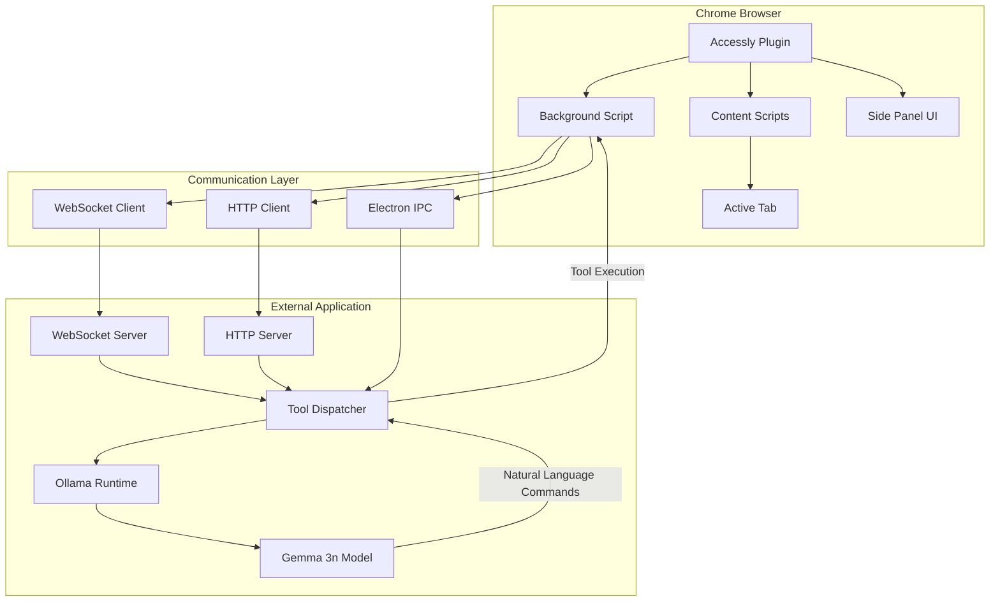
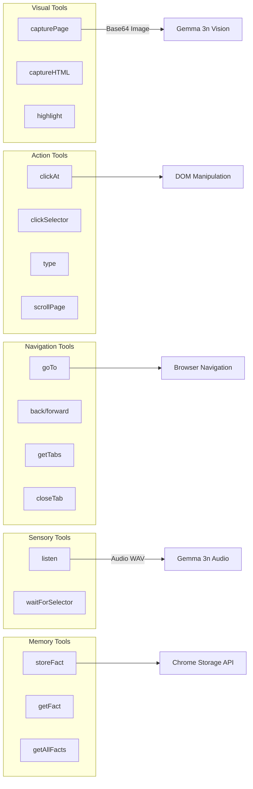
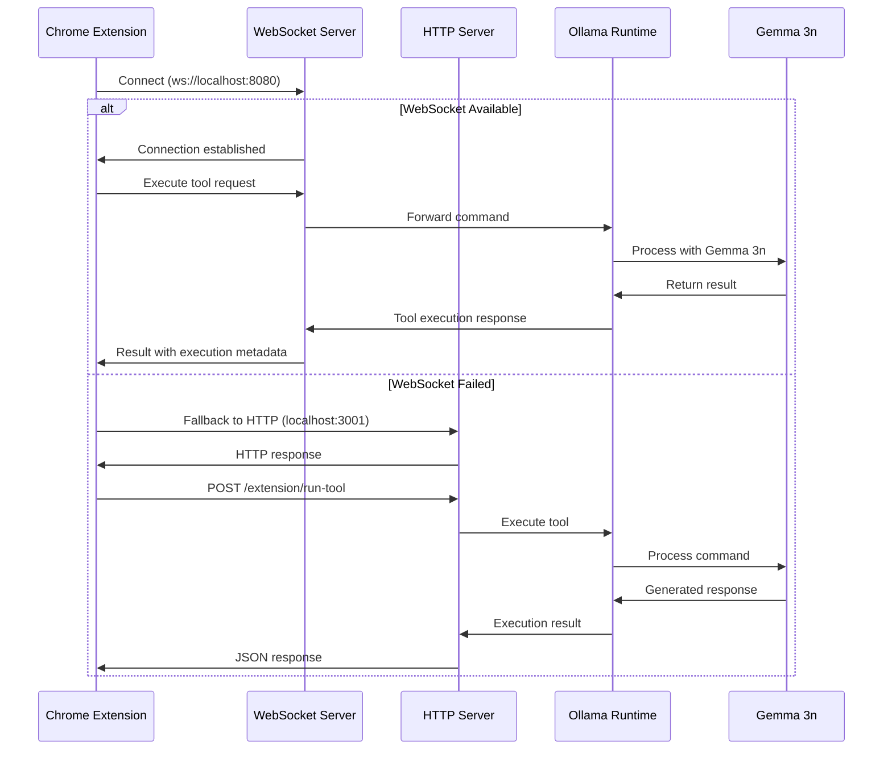
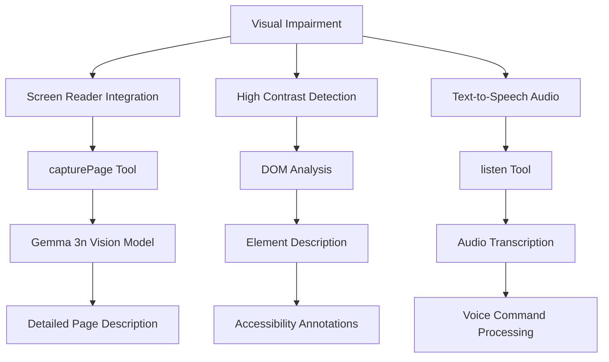
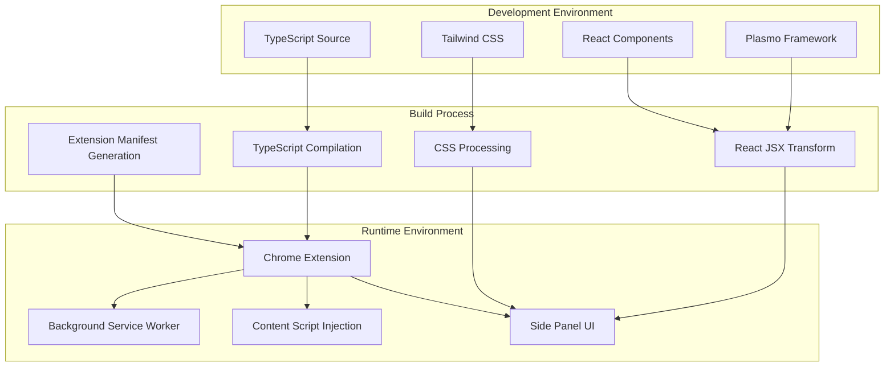

# Accessly Plugin for Chrome

    

A Chrome extension providing comprehensive web automation and accessibility tools through natural language control, powered by Gemma 3n running locally via Ollama. The plugin enables offline, private browser automation for users with disabilities, leveraging multimodal AI capabilities for vision, audio, and text processing.

## Architecture Overview

The Accessly Plugin operates as a multi-protocol communication bridge between Chrome browser and external applications running Gemma 3n models through Ollama.



## Core Components

The plugin architecture consists of four primary layers that enable seamless communication between the browser environment and the local Gemma 3n model running through Ollama.

| Component | Purpose | Technology |
|-----------|---------|------------|
| Background Script | Service worker managing tool execution and WebSocket connections | TypeScript, Plasmo Messaging |
| Content Scripts | DOM manipulation and page interaction handlers | JavaScript injection |
| Side Panel UI | Real-time monitoring and manual tool execution interface | React, Radix UI |
| Communication Layer | Multi-protocol client supporting WebSocket, HTTP, and Electron IPC | Native Web APIs |

## Gemma 3n Integration

The plugin leverages Gemma 3n's multimodal capabilities through Ollama runtime, enabling offline processing of natural language commands, visual content analysis, and audio transcription. The integration supports the model's Mix'n'Match architecture, allowing dynamic performance scaling based on system resources.

| Capability | Implementation | Gemma 3n Feature |
|------------|----------------|------------------|
| Visual Understanding | Screenshot capture with base64 encoding | Vision processing |
| Audio Processing | Tab audio capture and transcription | Speech-to-text |
| Natural Language Commands | Tool parameter extraction from conversational input | Text understanding |
| Dynamic Scaling | Automatic 2B/4B model switching based on complexity | Mix'n'Match submodels |

## Tool System Architecture

The plugin implements a comprehensive suite of automation tools categorized into five functional areas, each designed to support specific accessibility scenarios.



### Tool Categories and Implementation Status

| Category   | Tools |
|------------|-------|
| 🖼️ Visual     | `capturePage`, `captureHTML`, `highlight` |
| 🖱️ Action     | `clickAt`, `clickSelector`, `clickAllSelector`, `type`, `scrollPage`, `scrollBy`, `scrollTo`, `scrollIntoView` |
| 🧭 Navigation | `goTo`, `back`, `forward`, `reload`, `closeTab`, `getTabs` |
| 👂 Sensory    | `listen`, `waitForSelector` |
| 🧠 Memory     | `storeFact`, `getFact`, `getAllFacts`, `deleteFact` |

## Communication Protocols

The plugin supports multiple communication protocols with automatic fallback mechanisms for reliable connectivity to Gemma 3n runtime environments.



### Protocol Specifications

| Protocol | Port | Role | Timeout | Features |
|----------|------|------|---------|----------|
| WebSocket | 8080 | Real-time bidirectional | 30s | Auto-reconnect, keep-alive |
| HTTP | 3001 | Request-response fallback | 5s | RESTful API, JSON payloads |
| Electron IPC | N/A | Direct desktop integration | 10s | Native app communication |

## Accessibility Focus Areas

The Accessly Plugin addresses critical accessibility challenges through Gemma 3n's multimodal capabilities, providing offline solutions for users with various disabilities.

### Visual Accessibility



### Motor Accessibility

| Challenge | Solution | Tools Used |
|-----------|----------|------------|
| Limited mouse control | Voice-controlled clicking | `clickAt`, `clickSelector` + Gemma 3n speech processing |
| Keyboard navigation | Smart tab order detection | `waitForSelector`, `highlight` |
| Gesture difficulties | Natural language commands | All tools via conversational interface |

### Cognitive Accessibility

| Feature | Implementation | Benefit |
|---------|----------------|---------|
| Simple language processing | Gemma 3n's conversational understanding | Users can speak naturally instead of learning commands |
| Task memory assistance | `storeFact`/`getFact` tools with persistent storage | Remembers user preferences and frequently used actions |
| Progressive disclosure | Context-aware tool suggestions | Reduces cognitive load by showing relevant options |

## Prerequisites

| Requirement | Version | Download Link |
|-------------|---------|---------------|
| Node.js | 18+ | [nodejs.org](https://nodejs.org/download) |
| pnpm | 8+ | [pnpm.io](https://pnpm.io/installation) |
| Plasmo | Latest | [plasmo.com](https://docs.plasmo.com/framework#getting-started) |

## Setup Instructions

### Option 1: Direct Download (Recommended)

1. **Download the extension**
   - Go to the [Releases page](https://github.com/your-username/accessly-plugin/releases/tag/v1.0.0) of this repository
   - Download the latest `accessly-plugin-v1.0.0.zip` file

2. **Install in Chrome**
   - Open Chrome and navigate to `chrome://extensions/`
   - Enable **Developer mode** (toggle in the top-right corner)
   - Click **Load unpacked**
   - Extract the downloaded ZIP file and select the extracted folder
   - The Accessly Plugin should now appear in your extensions list

### Option 2: Build from Source

1. **Install Plasmo globally**
   ```bash
   npm install -g plasmo
   ```

2. **Clone and build the extension**
   ```bash
   git clone https://github.com/your-username/accessly-plugin.git
   cd accessly-plugin
   pnpm install
   pnpm run build
   ```

3. **Load the built extension**
   - Open Chrome and navigate to `chrome://extensions/`
   - Enable **Developer mode** (toggle in the top-right corner)
   - Click **Load unpacked**
   - Select the `build/chrome-mv3-prod` folder from your project directory

### Verification

After installation, you should see the Accessly Plugin icon in your Chrome toolbar. Click on it to open the side panel and verify the extension is working correctly.

## Technical Implementation

### Service Worker Architecture

The background script implements a persistent service worker with keep-alive mechanisms to maintain WebSocket connections and prevent Chrome from terminating the extension.

```typescript
// Keep-alive implementation
chrome.alarms.create("keep-alive", { periodInMinutes: 0.25 })
chrome.alarms.onAlarm.addListener(alarm => {
  if (alarm.name === "keep-alive") {
    // Prevents service worker termination
  }
});
```

### Tool Execution Pipeline

Each tool follows a standardized execution pattern with comprehensive error handling and logging:

1. **Parameter Validation** - Type checking and sanitization
2. **Tab Context Resolution** - Active tab identification and permission verification  
3. **Script Injection** - Content script execution in target page context
4. **Result Processing** - Data transformation and encoding for Gemma 3n
5. **Response Formatting** - Standardized JSON response with execution metadata

### Multimodal Data Processing

The plugin processes multiple data types for Gemma 3n consumption:

| Data Type | Processing | Output Format |
|-----------|------------|---------------|
| Screenshots | PNG capture → Base64 encoding | `data:image/png;base64,{data}` |
| Audio | MediaRecorder → WAV conversion | `data:audio/wav;base64,{data}` |
| HTML | DOM traversal → Sanitized markup | Structured HTML string |
| User Input | Event capture → Parameter objects | JSON with typed parameters |

## Performance Optimization

### Memory Management

- **Service Worker Persistence**: Custom keep-alive prevents connection drops
- **Data Streaming**: Large payloads (screenshots, audio) streamed rather than buffered
- **Cache Optimization**: Fact storage uses Chrome's unlimited storage quota

### Gemma 3n Model Efficiency

- **Dynamic Scaling**: Automatic 2B/4B model selection based on task complexity
- **Context Preservation**: Conversation state maintained across tool executions
- **Batch Processing**: Multiple tool commands processed in single model inference

## Development Architecture



### Build Configuration

The plugin uses Plasmo framework for modern Chrome extension development with TypeScript support, React integration, and automated manifest generation.

```json
{
  "scripts": {
    "dev": "plasmo dev",
    "build": "plasmo build", 
    "package": "plasmo package"
  }
}
```

## Security and Privacy

### Offline-First Design

The plugin prioritizes user privacy through local processing:

- **No Cloud Dependencies**: All AI processing occurs locally via Ollama
- **Data Isolation**: User data never leaves the local machine
- **Private Model Inference**: Gemma 3n runs entirely offline

### Permission Model

| Permission | Purpose | Scope |
|------------|---------|-------|
| `activeTab` | Current tab automation | Active tab only |
| `tabCapture` | Audio recording for transcription | User-initiated only |
| `scripting` | DOM manipulation and tool execution | Explicit user commands |
| `storage` | Fact persistence and preferences | Local Chrome storage |
| `sidePanel` | Extension UI display | Extension context only |

### Content Security Policy

The extension implements strict CSP headers preventing XSS attacks and ensuring secure script execution contexts.

## Integration with Gemma 3n Impact Challenge

This plugin demonstrates Gemma 3n's transformative potential for accessibility technology:

### Offline Accessibility
- **No Internet Required**: Critical for users in low-connectivity areas or with privacy concerns
- **Private Processing**: Sensitive accessibility data processed locally without cloud transmission
- **Real-time Response**: Sub-second tool execution for responsive user experience

### Multimodal Understanding
- **Vision + Audio + Text**: Comprehensive webpage understanding through multiple sensory channels
- **Context Awareness**: Gemma 3n maintains conversation context across multiple tool executions
- **Natural Language Interface**: Users interact conversationally rather than learning technical commands

### Technical Innovation
- **Mix'n'Match Architecture**: Dynamic model scaling optimizes performance vs. accuracy tradeoffs
- **Edge Deployment**: Demonstrates practical on-device AI in resource-constrained browser environment
- **Tool Orchestration**: Complex multi-step accessibility tasks automated through natural language
